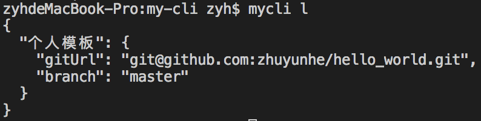

# 闲云野鹤  
自产一个脚手架工具，可以从任何远程仓库中获取你需要的文件。  
一般用来获取一些模板文件，用于项目前期快速开始。

## xianyun

### Install
```
npm i xianyun -g
```
### Usage  

#### xianyun list or xianyun l  
列出现有模板仓库   

---

#### xianyun add or xianyun a  
添加一个模板仓库

---


#### xianyun init or xianyun i  
使用一个模板

#### xianyun delete or xianyun d  
删除一个模板